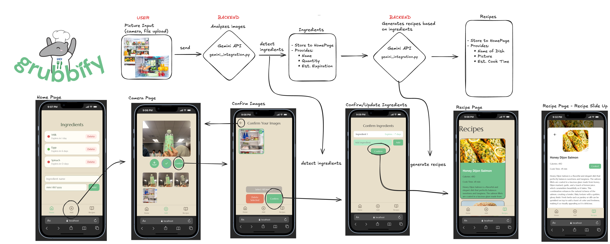

## Inspiration:
**grubbify** was inspired by the frustration of seeing food go bad in your fridge because you don’t know what to make, ultimately wasting money and ingredients. We wanted to create a tool that sustainably helps students use what they already have and reduce food waste.

## What it does:
**grubbify** allows students to snap photos or upload images of their ingredients, which our AI-powered system analyzes to detect what you have, track quantities and estimated expiration dates, and generate recipes based on those ingredients. It helps students plan meals efficiently and make better use of their food.

## How we built it:

We built the frontend using React, HTML, CSS, and Vite, while the backend leverages Gemini wrappers in Python to handle image analysis and recipe generation. The system identifies ingredients from photos in real-time and creates recipes dynamically, making the process seamless for users.

## Challenges we ran into:
Some challenges we faced included formatting and maintaining consistency in the frontend. Backend challenges, such as handling image processing, integrating AI analysis, and merging the front and backend. 

## Accomplishments we’re proud of:
We’re proud of enabling real-time photo uploads, accurately detecting ingredients, tracking quantities, and generating recipes from these inputs. The system successfully connects image recognition to actionable cooking suggestions, helping students reduce food waste. We were also proud of how the whole workflow was able to come together (Gemini API, Fast API, etc).

## What we learned:
We learned the importance of clear communication between frontend and backend teams and gained hands-on experience working with AI-powered tools, APIs, and real-time data processing. In addition using GitHub as a team to collaborate on a project without any major issues was a great learning experience. 

## What’s next for grubbify:
Looking ahead, we plan to incorporate nutritional information like carbs and protein, add user logins and collaborative “Fridge” access for roommates, and expand the database to track ingredient history across multiple users. These updates will make cooking more sustainable, efficient, and social.